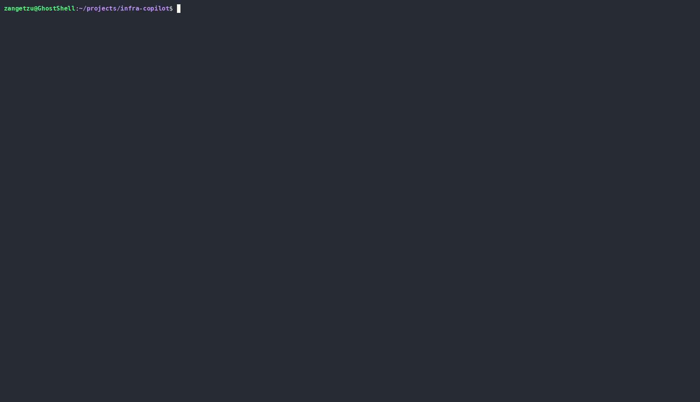

<div align="center">

# 🤖 infra-copilot

**Ask your infrastructure questions in plain English. Runs 100% locally on your GPU.**

[](https://github.com/lsalazarm-sec/infra-copilot/actions)
[](https://www.python.org/downloads/)
[](LICENSE)
[](https://ollama.com)
[](https://rocm.docs.amd.com)

[Demo](#-demo) · [Why this exists](#-why-this-exists) · [Features](#-features) · [Quickstart](#-quickstart) · [Architecture](#-architecture) · [Safety](#-safety-model) · [Docs](#-documentation)

</div>

---

## 🎬 Demo

### CLI — one-shot queries


> Ask a question, get an answer. The agent runs `kubectl` and shell commands under the hood,
> reasons about the real output, and responds in plain English. No copy-pasting, no tab switching.

### TUI — interactive session


> The interactive mode lets you have a back-and-forth conversation with your infrastructure.
> Each question builds on the context of the session. Press `Ctrl+C` to exit.

> The agent runs `kubectl` and `df` under the hood, reasons about the output, and responds in plain English. No copy-pasting commands, no tab switching.

---

## Why this exists

Debugging infrastructure means context-switching between 8 terminal tabs before you even start reasoning about what went wrong — `kubectl`, `journalctl`, `top`, `ss`, logs, events, all at once.

`infra-copilot` is a local LLM agent that does the data gathering for you. You ask a question in plain English, it runs the right commands against your real infrastructure, reads the output, and explains what it found.

**No data leaves your network.** The LLM runs entirely on your GPU via [Ollama](https://ollama.com). No API keys, no subscriptions, no usage costs.

Built and tested on an AMD Radeon RX 7700 XT with ROCm 7.x on Ubuntu 24.04.

---

## Features

- 🧠 **Local LLM inference** — Qwen 2.5 Coder 14B running on your GPU via Ollama. Swap models with one config change.
- 🛠️ **Real tool execution** — the agent actually runs `kubectl`, `journalctl`, `df`, `ps`, `ss`, and more. Not a wrapper around `kubectl explain`.
- 🔒 **Safety-first design** — read-only by default. Strict command allowlist. No shell string interpolation. Every action is audited.
- 📋 **JSONL audit log** — every command, its arguments, output size, and latency logged to `~/.local/share/infra-copilot/audit.jsonl`.
- 🖥️ **TUI + CLI** — interactive Textual UI for conversations, one-shot CLI for scripting.
- 🔄 **ReAct reasoning loop** — the agent iterates: decide → execute tool → reason about output → decide again, until it has a complete answer.
- 🐧 **Linux-first, AMD-ready** — built on Ubuntu 24.04 with ROCm 7.x. Works with NVIDIA and CPU too.

---

## Quickstart

### Prerequisites

- Linux (Ubuntu 24.04 recommended)
- Python 3.12+
- [Ollama](https://ollama.com) installed and running
- `kubectl` configured with at least one cluster (local or remote)

### Install

```bash
# Pull the model (one-time, ~9GB)
ollama pull qwen2.5-coder:14b

# Clone and install
git clone https://github.com/lsalazarm-sec/infra-copilot.git
cd infra-copilot
uv sync

# Initialize config
copilot init
```

### One-shot query

```bash
copilot ask "why is the api-gateway pod restarting?"
copilot ask "which nodes have the most memory pressure?"
copilot ask "how much disk space is left on this machine?"
```

### Interactive TUI

```bash
copilot tui
```

### Available commands

```
copilot ask <question>   One-shot query
copilot tui              Interactive TUI session
copilot init             Create default config file
copilot version          Print version
```
---

## 🏗️ Architecture

```bash
User question (CLI / TUI)
│
▼
┌─────────────────────────────────────┐
│         ReAct Agent Loop            │
│                                     │
│  1. Send prompt to LLM              │
│  2. Parse tool call from response   │
│  3. Execute tool with safety check  │
│  4. Feed output back to LLM         │
│  5. Repeat until final answer       │
└──────────────┬──────────────────────┘
│
┌────────┴────────┐
▼                 ▼
Ollama API         Tool Router
(local GPU)        │
Qwen 2.5           ├── kubectl (get, describe, logs...)
Coder 14B          ├── shell (journalctl, df, ps, ss...)
└── audit log (JSONL)

The agent uses a **ReAct (Reason + Act) loop** — it reasons about what information it needs, calls a tool, gets real output, and reasons again. This means answers are always grounded in actual system state, not hallucinated.

See [docs/architecture.md](docs/architecture.md) for full design decisions and trade-offs.

```
---

## 🛡️ Safety model

Security is a first-class concern. The agent cannot do anything you haven't explicitly permitted.

| Guardrail | Default | Override |
|---|---|---|
| Read-only mode | ✅ ON | `--write` flag (not yet implemented) |
| kubectl allowed verbs | `get`, `describe`, `logs`, `top`, `explain`, `version` | `~/.config/infra-copilot/config.yaml` |
| Shell allowed binaries | `journalctl`, `systemctl`, `ps`, `ss`, `df`, `free`, `uptime`, `ip` | `config.yaml` |
| No shell string interpolation | Always | Not overridable |
| Audit log | Always on | `config.yaml` |

> **Note:** This is not a substitute for proper RBAC. Use a least-privilege kubeconfig. The copilot inherits whatever permissions your kubectl context has.

---

## ⚙️ Configuration

Default config is created at `~/.config/infra-copilot/config.yaml` by running `copilot init`:

```yaml
llm:
  provider: ollama
  base_url: http://localhost:11434
  model: qwen2.5-coder:14b
  temperature: 0.1
  timeout_seconds: 120

safety:
  read_only: true
  require_confirmation: true
  audit_log: true
  kubectl_allowed_verbs:
    - get
    - describe
    - logs
    - top
    - explain
    - version
  shell_allowed_cmds:
    - journalctl
    - systemctl
    - ps
    - ss
    - df
    - free
    - uptime
    - ip
```

---

## 🖥️ AMD GPU setup (ROCm)

Built and tested on:
- **GPU:** AMD Radeon RX 7700 XT (gfx1101, 12GB VRAM)
- **ROCm:** 7.2.3
- **OS:** Ubuntu 24.04.4 LTS
- **Ollama:** 0.24.0 with native ROCm support

See [docs/rocm-setup.md](docs/rocm-setup.md) for the full setup guide from scratch.

---

## 🗺️ Roadmap

### v0.1 — Core agent (current)
- [x] ReAct agent with kubectl and shell tools
- [x] JSONL audit log
- [x] CLI (one-shot queries)
- [x] TUI (interactive sessions)
- [x] Safety allowlist
- [x] Adaptive response format

### v0.2 — Observability
- [ ] Prometheus / PromQL tool
- [ ] Node metrics and resource pressure detection
- [ ] Multi-cluster context switching

### v0.3 — Security integrations
- [ ] Wazuh API tool — query alerts, agents, and security events
- [ ] SSH executor (opt-in per host)
- [ ] Alert correlation across kubectl + Wazuh

### v0.4 — Polish
- [ ] RAG over runbooks and postmortems
- [ ] Session export to Markdown
- [ ] Write mode with confirmation prompt
- [ ] Plugin system for custom tools

---

---

## 📖 Documentation

- [Architecture](docs/architecture.md)
- [ROCm setup guide](docs/rocm-setup.md)
- [Adding a custom tool](docs/custom-tools.md)
- [Configuration reference](docs/configuration.md)

---

## 🛠️ Development

```bash
git clone https://github.com/lsalazarm-sec/infra-copilot.git
cd infra-copilot
uv sync --all-extras --dev

# Run tests
uv run pytest -v

# Lint
uv run ruff check .
uv run ruff format .
```

---

## 🤝 Contributing

PRs welcome. See [CONTRIBUTING.md](CONTRIBUTING.md) for guidelines.

---

## 📄 License

MIT © [Luis Salazar](https://github.com/lsalazarm-sec)
